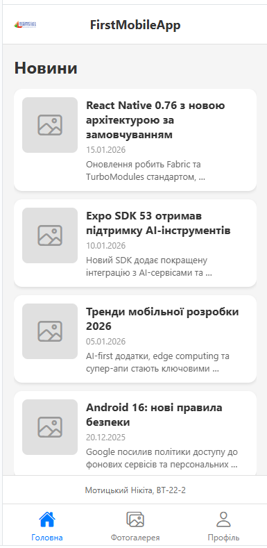
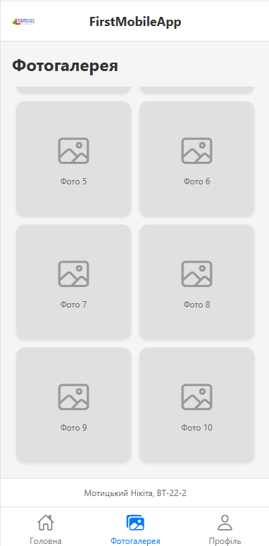
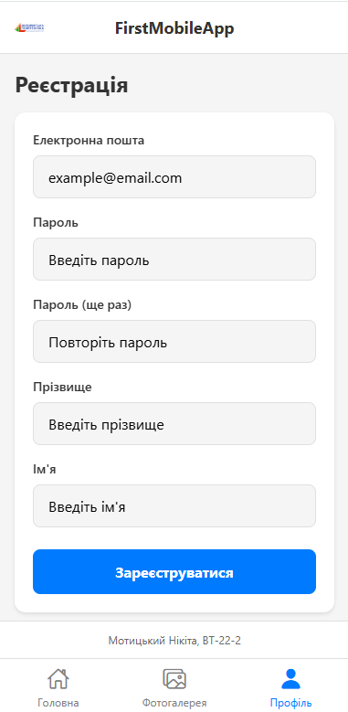

# FirstMobileApp

React Native додаток на Expo з 3 екранами та нижньою навігацією.

## Запуск

### 1. Expo Go (телефон)

Запустити на реальному пристрої.

```bash
npm install
npx expo start
```

### 2. Android Emulator

1. Встановити Android Studio
2. Tools → Device Manager → створити AVD
3. Запустити емулятор
4. `npx expo start --android`

### 3. Snack Expo (браузер)

1. Зайти на [snack.expo.dev](https://snack.expo.dev)
2. Скопіювати структуру папок і файли
3. Скинути logo.png в assets
4. Вибрати платформу і дивитися результат

## Скріншоти

### Головна



### Фотогалерея



### Профіль


