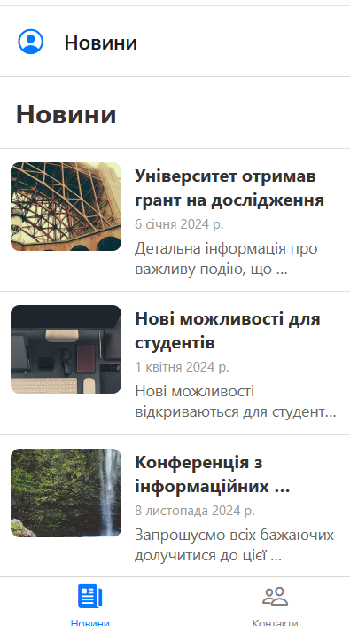
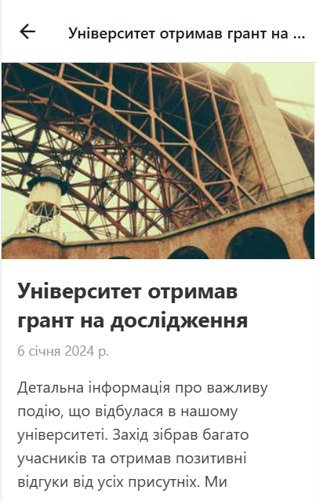
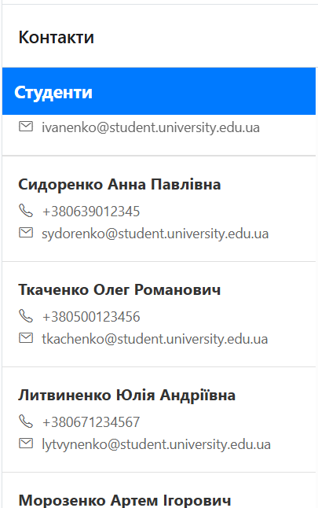
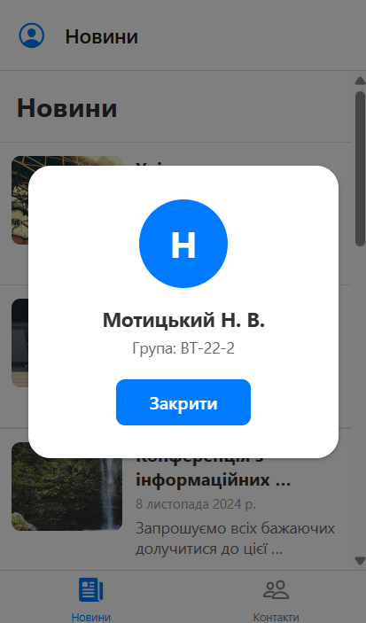

# Лабораторна робота №2

## Мобільний додаток на React Native Expo

Додаток для перегляду новин та контактів з використанням Drawer та Stack навігації.

---

## Встановлення та запуск

### Варіант 1: Expo Go (рекомендовано)

1. Встановіть Expo Go на мобільний пристрій:
   - [Android](https://play.google.com/store/apps/details?id=host.exp.exponent)
   - [iOS](https://apps.apple.com/app/expo-go/id982107779)

2. Встановіть залежності та запустіть проект:
   ```bash
   npm install
   npx expo start
   ```

3. Відскануйте QR-код камерою (iOS) або в Expo Go (Android)

### Варіант 2: Snack Expo (онлайн)

1. Відкрийте [snack.expo.dev](https://snack.expo.dev)
2. Скопіюйте вміст `App.js` у редактор
3. Додаток автоматично запуститься у браузері або на пристрої

### Варіант 3: Емулятор

1. Встановіть Android Studio або Xcode
2. Запустіть емулятор
3. Виконайте:
   ```bash
   npm install
   npx expo start --android  # або --ios
   ```

---

## Реалізовані функції

### Навігація
- **Drawer Navigator** - бічне меню з кастомним контентом
- **Stack Navigator** - вкладена навігація для екранів новин
- Коректна обробка заголовків (без дублювання)

### MainScreen (Новини)
- **FlatList** з оптимізацією:
  - `initialNumToRender={10}`
  - `maxToRenderPerBatch={5}`
  - `windowSize={10}`
- **Pull-to-Refresh** - оновлення списку (1.5с затримка)
- **Infinite Scroll** - завантаження по 10 новин при скролі
- **ListHeaderComponent** - заголовок "Новини"
- **ListFooterComponent** - індикатор завантаження
- **ItemSeparatorComponent** - розділювач між елементами

### DetailsScreen (Деталі новини)
- Динамічний заголовок з назвою новини
- Велике зображення
- Повний опис новини
- Дата публікації

### ContactsScreen (Контакти)
- **SectionList** з групуванням:
  - Викладачі
  - Адміністрація
  - Студенти
- Стилізовані заголовки секцій
- Контактна інформація: ім'я, телефон, email

### Custom Drawer
- Аватар з ініціалами
- ПІБ: Мотицький Н. В.
- Група: ВТ-22-2
- Пункти меню з іконками

---

## Скріншоти

*Місце для скріншотів*

|                  Головний екран                   |                      Деталі новини                       |                   Контакти                   |                 Drawer меню                  |
|:-------------------------------------------------:|:--------------------------------------------------------:|:--------------------------------------------:|:--------------------------------------------:|
|            |  |  |  |

---

## Контрольні питання

### 1. Чим відрізняється FlatList від ScrollView?

**ScrollView:**
- Рендерить усі дочірні елементи одночасно
- Підходить для невеликої кількості елементів
- Споживає багато пам'яті при великих списках
- Простіший у використанні для статичного контенту

**FlatList:**
- Використовує віртуалізацію - рендерить лише видимі елементи
- Оптимізований для довгих списків з великою кількістю даних
- Економить пам'ять та покращує продуктивність
- Підтримує pull-to-refresh, infinite scroll, розділювачі
- Має вбудовані props для оптимізації: `initialNumToRender`, `maxToRenderPerBatch`, `windowSize`

### 2. Що таке віртуалізація списків?

**Віртуалізація** - це техніка оптимізації, при якій рендеряться тільки ті елементи списку, які наразі видимі на екрані (плюс невеликий буфер).

### 3. Як здійснюється передача параметрів між екранами?

**Передача параметрів (при навігації):**
```javascript
// Відправлення параметрів
navigation.navigate('Details', { item: newsItem });

// Або через push
navigation.push('Details', { id: 123, title: 'Заголовок' });
```

**Отримання параметрів:**
```javascript
// У функціональному компоненті через route.params
const DetailsScreen = ({ route }) => {
  const { item } = route.params;
  return <Text>{item.title}</Text>;
};

// Або через хук useRoute
import { useRoute } from '@react-navigation/native';

const DetailsScreen = () => {
  const route = useRoute();
  const { item } = route.params;
};
```

**Початкові параметри:**
```javascript
<Stack.Screen
  name="Details"
  component={DetailsScreen}
  initialParams={{ itemId: 42 }}
/>
```

**Оновлення параметрів:**
```javascript
navigation.setParams({ title: 'Новий заголовок' });
```

### 4. Що таке вкладена навігація?

**Вкладена навігація (Nested Navigation)** - це патерн, коли один навігатор знаходиться всередині екрану іншого навігатора.

### 5. У яких випадках застосовується SectionList?

**SectionList** використовується для відображення списків, згрупованих по секціях (категоріях).
