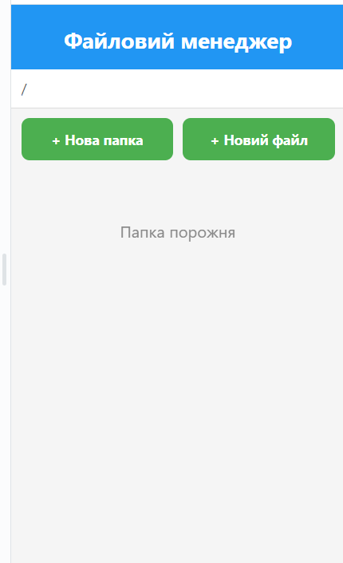
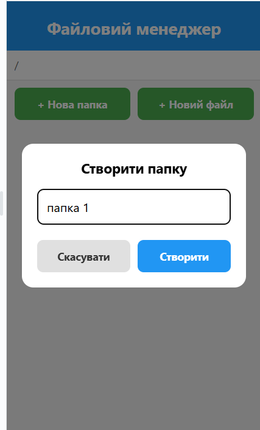
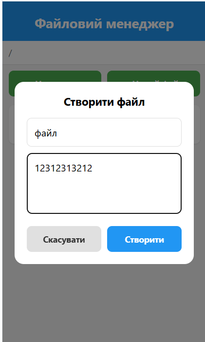
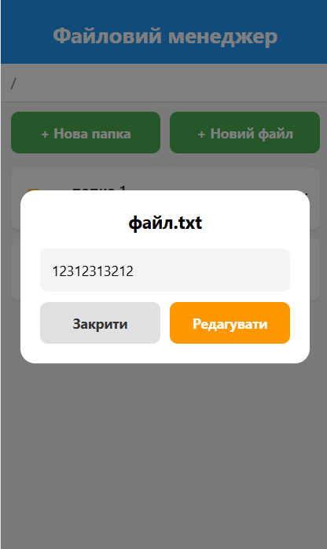
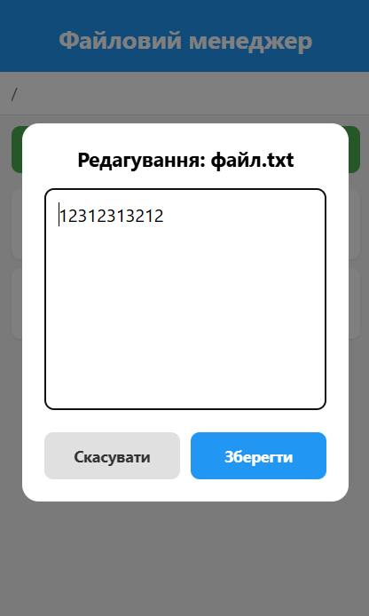
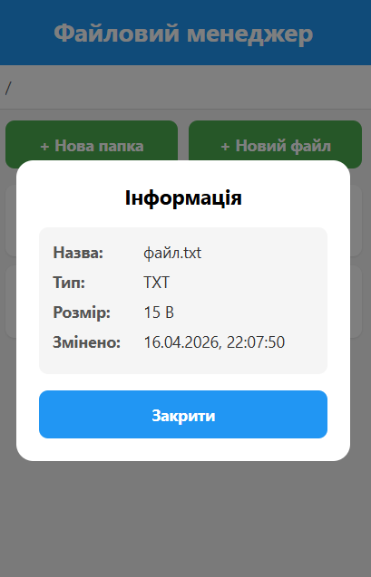
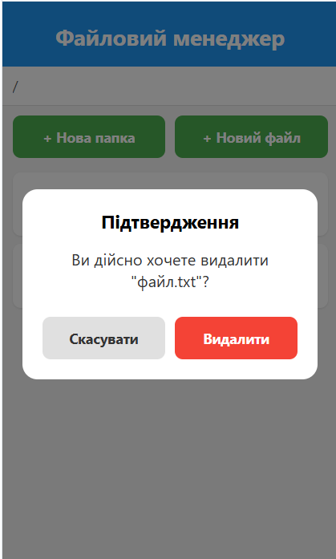

# Файловий менеджер

## Інструкція запуску

### Встановлення залежностей

```bash
cd FileManager
npm install
```

### Запуск застосунку

```bash
# Запуск у веб-браузері
npm run web

# Запуск на Android
npm run android

# Запуск на iOS
npm run ios

# Універсальний запуск
npm start
```

### Вимоги

- Node.js 18+
- npm або yarn
- Expo CLI (встановлюється автоматично)
- Для Android: Android Studio з емулятором або фізичний пристрій
- Для iOS: Xcode (тільки macOS)

## Реалізований функціонал

### 1. Навігація по файловій системі
- Відображення поточного шляху (breadcrumb)
- Список файлів та папок у поточній директорії
- Перехід у вкладені папки (натискання на папку)
- Повернення до батьківської директорії (кнопка "Вгору")
- Сортування: спочатку папки, потім файли

### 2. Створення
- Створення нової папки з довільною назвою
- Створення текстового файлу (.txt) з початковим вмістом

### 3. Зчитування
- Відкриття .txt файлів для перегляду вмісту
- Прокручування для великих файлів

### 4. Редагування
- Модифікація вмісту текстових файлів
- Збереження змін до файлу

### 5. Видалення
- Видалення файлів та папок
- Підтвердження перед видаленням

### 6. Перегляд інформації про файл
- Назва файлу
- Тип файлу (за розширенням)
- Розмір файлу
- Дата останньої модифікації

## Структура проекту

```
FileManager/
├── App.js              # Головний файл застосунку
├── package.json        # Залежності проекту
├── screenshots/        # Скріншоти роботи
└── README.md           # Документація
```

### Компоненти (в App.js)

- **Header** - заголовок застосунку
- **PathBar** - панель навігації з поточним шляхом
- **ActionBar** - кнопки створення файлів/папок
- **FileList** - список файлів та папок
- **FileItem** - елемент списку
- **CreateFolderModal** - модальне вікно створення папки
- **CreateFileModal** - модальне вікно створення файлу
- **ViewFileModal** - перегляд вмісту файлу
- **EditFileModal** - редагування файлу
- **FileInfoModal** - інформація про файл
- **DeleteConfirmModal** - підтвердження видалення

## Скріншоти роботи застосунку

### Головний екран



### Створення папки



### Створення файлу



### Перегляд файлу



### Редагування файлу



### Інформація про файл



### Підтвердження видалення


