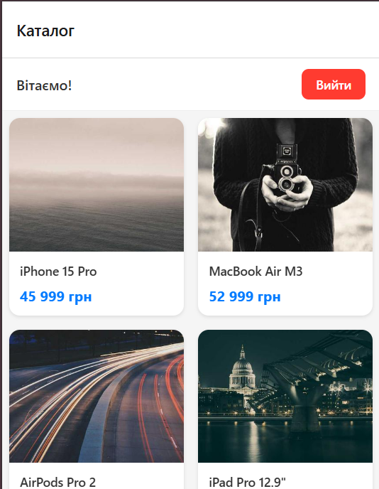

# Лабораторна робота №5

## Тема
Побудова навігації у React Native із використанням бібліотеки Expo Router.

## Мета
Ознайомлення з концепцією file-based маршрутизації в мобільних застосунках.

---

## Інструкція запуску

1. Встановити залежності:
```bash
npm install
```

2. Запустити проєкт:
```bash
npx expo start
```

3. Відкрити застосунок:
   - Натисніть `a` для запуску на Android емуляторі
   - Натисніть `w` для запуску у веб-браузері
   - Скануйте QR-код за допомогою Expo Go на фізичному пристрої

---

## Опис реалізованого функціоналу

### Структура проєкту
```
app/
├── _layout.jsx          # Кореневий layout з AuthProvider
├── index.jsx            # Початкове перенаправлення
├── +not-found.jsx       # Екран 404
├── (auth)/              # Група публічних маршрутів
│   ├── _layout.jsx      # Layout для auth екранів
│   ├── login.jsx        # Екран входу
│   └── register.jsx     # Екран реєстрації
└── (app)/               # Група захищених маршрутів
    ├── _layout.jsx      # Layout з перевіркою авторизації
    ├── index.jsx        # Каталог товарів
    └── details/
        └── [id].jsx     # Динамічний маршрут деталей товару

context/
└── AuthContext.jsx      # Глобальний контекст авторизації

data/
└── products.js          # Масив тестових даних товарів
```

### Реалізовані функції

1. **Контекст авторизації (AuthContext)**
   - Зберігає стан `isAuthenticated` та дані користувача
   - Методи: `login(email, password)`, `register(email, password, name)`, `logout()`

2. **Публічні екрани**
   - **Вхід** (`/login`): форма з полями Email та Пароль
   - **Реєстрація** (`/register`): форма з полями Ім'я, Email, Пароль, Підтвердження паролю

3. **Захищені екрани**
   - **Каталог** (`/(app)`): список товарів у вигляді сітки з FlatList
   - **Деталі товару** (`/(app)/details/[id]`): повна інформація про обраний товар

4. **Навігація**
   - File-based маршрутизація за допомогою Expo Router
   - Автоматичне перенаправлення неавторизованих користувачів
   - Динамічні маршрути для сторінок товарів

5. **Обробка помилок**
   - Екран 404 для неіснуючих маршрутів

---

## Скріншоти роботи застосунку

1. Екран входу

2. Екран реєстрації

3. Каталог товарів

4. Деталі товару

5. Екран 404


---

## Висновки (відповіді на контрольні запитання)

### 1. Яким чином за допомогою Expo Router реалізується перенаправлення неавторизованого користувача?

Перенаправлення неавторизованого користувача реалізується у файлі `_layout.jsx` відповідної групи захищених маршрутів. У нашому випадку це `app/(app)/_layout.jsx`:

```jsx
import { Redirect, Stack } from 'expo-router';
import { useAuth } from '../../context/AuthContext';

export default function AppLayout() {
  const { isAuthenticated } = useAuth();

  if (!isAuthenticated) {
    return <Redirect href="/login" />;
  }

  return <Stack />;
}
```

Компонент `<Redirect>` з expo-router виконує декларативне перенаправлення на вказаний маршрут. Перевірка стану авторизації відбувається при кожному рендері layout-компонента, що гарантує захист всіх вкладених екранів.

### 2. У чому полягає різниця між використанням компонента `<Link>` та методу `router.push()`?

**`<Link>` компонент:**
- Декларативний підхід до навігації
- Використовується безпосередньо в JSX як обгортка або самостійний елемент
- Автоматично обробляє події натискання
- Підтримує prop `asChild` для передачі навігаційної поведінки дочірньому компоненту
- Краще підходить для статичних посилань у UI

```jsx
<Link href="/details/1" asChild>
  <TouchableOpacity>...</TouchableOpacity>
</Link>
```

**`router.push()` метод:**
- Імперативний підхід до навігації
- Використовується в обробниках подій та логіці компонентів
- Дозволяє програмно керувати навігацією
- Можна викликати після виконання певних умов (валідація, API запити)
- Краще підходить для динамічної навігації

```jsx
const handleLogin = () => {
  if (login(email, password)) {
    router.replace('/(app)');
  }
};
```

### 3. Як працюють динамічні маршрути в Expo Router і як отримати передані параметри?

Динамічні маршрути створюються за допомогою квадратних дужок у назві файлу. Наприклад, `[id].jsx` створює маршрут, який може приймати будь-яке значення замість `id`.

**Створення динамічного маршруту:**
```
app/(app)/details/[id].jsx  →  /details/1, /details/2, /details/abc
```

**Отримання параметрів:**
Для отримання переданих параметрів використовується хук `useLocalSearchParams()`:

```jsx
import { useLocalSearchParams } from 'expo-router';

export default function ProductDetails() {
  const { id } = useLocalSearchParams();
  // id буде містити значення з URL, наприклад "1"

  const product = products.find(p => p.id === id);
  return <Text>{product.name}</Text>;
}
```

Також можна використовувати `useGlobalSearchParams()` для отримання параметрів з будь-якої частини URL.

### 4. Чому стан авторизації доцільно зберігати у глобальному контексті (React Context), а не в локальному стані компонента?

**Причини використання глобального контексту:**

1. **Доступність з будь-якого компонента**: стан авторизації потрібен у багатьох місцях застосунку (layout файли, навігаційні компоненти, захищені екрани).

2. **Єдине джерело істини**: всі компоненти отримують однакові дані про авторизацію, що запобігає неконсистентності.

3. **Уникнення prop drilling**: не потрібно передавати стан через численні рівні компонентів.

4. **Централізоване управління**: методи login, logout, register знаходяться в одному місці, що спрощує підтримку.

5. **Персистентність при переходах**: стан зберігається при навігації між екранами.

**Недоліки локального стану:**
- Втрата даних при розмонтуванні компонента
- Необхідність синхронізації між компонентами
- Складність доступу з вкладених компонентів

### 5. Для чого використовуються групи маршрутів `(folderName)` і як вони впливають на URL-адресу?

**Призначення груп маршрутів:**

1. **Логічне розділення екранів**: дозволяють організувати код за функціональними блоками (авторизація, основний застосунок, налаштування).

2. **Спільні layouts**: кожна група може мати власний `_layout.jsx` з унікальними налаштуваннями навігації.

3. **Захист маршрутів**: легко реалізувати перевірку авторизації для цілої групи екранів.

4. **Чистіша структура**: покращує читабельність та підтримку коду.

**Вплив на URL-адресу:**

Назва групи в дужках **ігнорується** у кінцевій URL-адресі:

```
app/(auth)/login.jsx    →  /login     (не /(auth)/login)
app/(app)/index.jsx     →  /          (не /(app))
app/(app)/details/[id]  →  /details/1 (не /(app)/details/1)
```

Це дозволяє мати чисті URL без зайвих сегментів, зберігаючи при цьому логічну організацію файлів у проєкті.

---

## Використані технології

- React Native
- Expo SDK 54
- Expo Router 6
- React Context API
