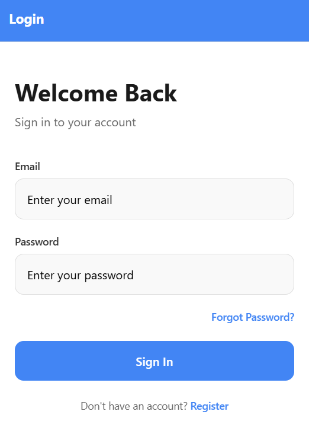
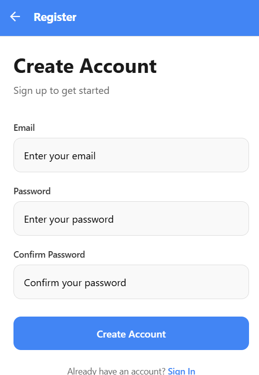
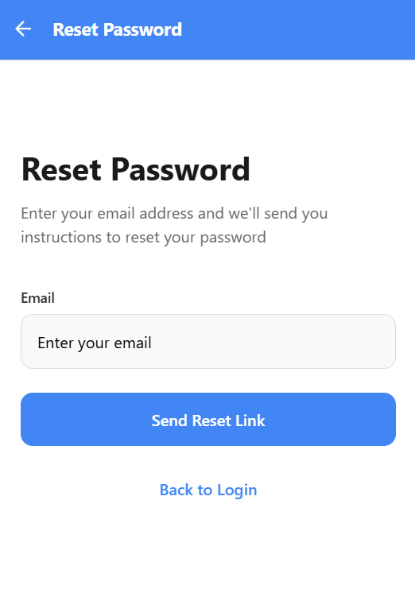
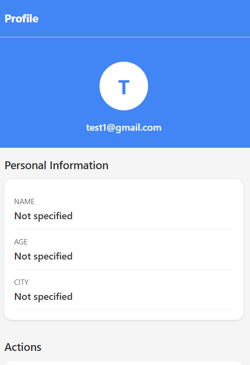
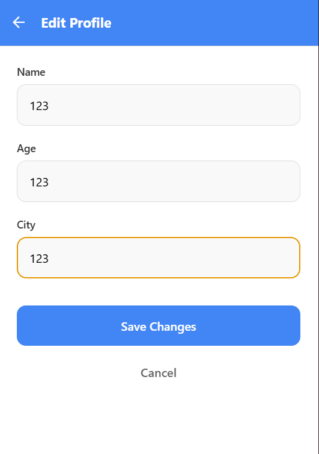
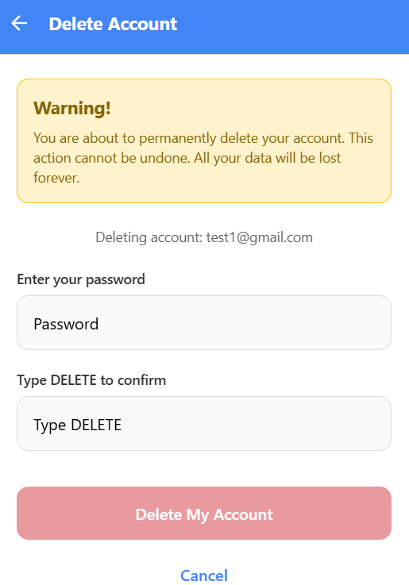

# Лабораторна робота №6

## Тема
Побудова авторизації та збереження персональних даних у React Native з використанням Firebase Authentication та Firestore

## Опис
Мобільний застосунок з повною системою авторизації та управління профілем користувача, побудований на React Native з використанням Expo Router та Firebase.

## Реалізований функціонал

### 1. Авторизація користувача
- Реєстрація нового користувача за допомогою email та пароля
- Вхід існуючого користувача
- Вихід із системи з підтвердженням

### 2. Збереження персональних даних
- Після входу користувач може заповнити/оновити свій профіль:
  - Ім'я
  - Вік
  - Місто
- Дані зберігаються у Firestore у колекції `users`, в документі з ID, що дорівнює `uid` користувача

### 3. Захист доступу
- Всі запити до Firestore здійснюються із валідацією uid
- Користувач може працювати лише з власним документом
- Перевірка реалізована як у клієнтському коді (AuthContext), так і через Firestore Security Rules

### 4. Редагування та видалення облікового запису
- Можливість змінити дані профілю через форму
- Кнопка "Видалити акаунт" з підтвердженням
- Повторна автентифікація (введення паролю) перед видаленням облікового запису

### 5. Відновлення паролю
- Можливість відновити пароль через email, використовуючи Firebase API

## Технічні особливості

- **Firebase Authentication** - для входу, реєстрації, скидання паролю
- **Firebase Firestore** - для зберігання персональних даних користувача
- **Expo Router** - захищена навігація через групи маршрутів `(auth)` / `(app)` та Redirect у `_layout.jsx`
- **AuthContext** - для централізованого керування статусом авторизованого користувача

## Структура проекту

```
lab6/
├── app/
│   ├── _layout.jsx           # Головний layout з AuthProvider
│   ├── index.jsx             # Редірект на auth або app
│   ├── (auth)/               # Група для неавторизованих користувачів
│   │   ├── _layout.jsx
│   │   ├── login.jsx         # Екран входу
│   │   ├── register.jsx      # Екран реєстрації
│   │   └── forgot-password.jsx # Відновлення паролю
│   └── (app)/                # Група для авторизованих користувачів
│       ├── _layout.jsx
│       ├── index.jsx         # Профіль користувача
│       ├── edit-profile.jsx  # Редагування профілю
│       └── delete-account.jsx # Видалення акаунту
├── config/
│   └── firebase.js           # Конфігурація Firebase
├── context/
│   └── AuthContext.jsx       # Контекст авторизації
├── firestore.rules           # Правила безпеки Firestore
├── package.json
└── README.md
```

## Інструкція запуску

### 1. Налаштування Firebase

1. Створіть проект у [Firebase Console](https://console.firebase.google.com/)
2. Увімкніть Authentication з провайдером Email/Password
3. Створіть базу даних Firestore
4. Скопіюйте конфігурацію Firebase та вставте у файл `config/firebase.js`

### 2. Налаштування Firestore Security Rules

Скопіюйте правила з файлу `firestore.rules` у Firebase Console:
1. Відкрийте Firestore Database
2. Перейдіть на вкладку "Rules"
3. Вставте правила та натисніть "Publish"

### 3. Встановлення залежностей

```bash
cd lab6
npm install
```

### 4. Запуск застосунку

```bash
npm start
```

Після запуску:
- Натисніть `a` для запуску на Android емуляторі/пристрої
- Натисніть `i` для запуску на iOS симуляторі (тільки macOS)
- Натисніть `w` для запуску у веб-браузері
- Скануйте QR-код за допомогою Expo Go на мобільному пристрої

## Скріншоти

### Екран входу


### Екран реєстрації


### Відновлення паролю


### Профіль користувача


### Редагування профілю


### Видалення акаунту


## Firestore Security Rules

```javascript
rules_version = '2';
service cloud.firestore {
  match /databases/{database}/documents {
    match /users/{userId} {
      allow read, write: if request.auth != null && request.auth.uid == userId;
    }
  }
}
```

## Висновки

У ході виконання лабораторної роботи було:

1. Набуто практичних навичок інтеграції Firebase Authentication у React Native застосунок
2. Реалізовано повний цикл авторизації: реєстрація, вхід, вихід, відновлення паролю
3. Впроваджено збереження персональних даних у Firebase Firestore
4. Налаштовано захист доступу до даних через Security Rules
5. Реалізовано редагування та видалення облікового запису з повторною автентифікацією
6. Використано Expo Router для організації навігації з захищеними маршрутами
7. Створено AuthContext для централізованого керування станом авторизації

Застосунок демонструє best practices роботи з Firebase у мобільних додатках, включаючи правильне налаштування Security Rules для захисту даних користувачів.
